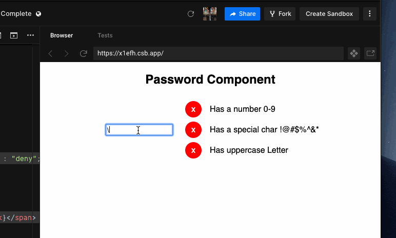

# Apps Take Home Assessment

The purpose of this assessment is for you to show us at Qventus what you’re capable of building, in a lower pressure environment and in an environment you like working in.

## Process

1. Code your solution to the problem
2. Create a github project under your github username and push your solution
3. Share the project with us when you’re comfortable with it. Make sure your README has notes on how to build and run your solution. Feel free to add any assumptions you made and any future development you might suggest going forward.

## Problem

We have many different React frontend applications, all of which currently use their own password validation for users creating a new password. This is less than ideal, since whenever there’s an issue we sometimes fix it in one frontend, and not another. Recently, the security consultants have told us we need to add another constraint to all our applications on passwords, so now is the time to refactor these applications to use a single, shared library.

However, not all our applications have the same password requirements - some of our applications require longer passwords in order to comply with certain regulations, some require special characters and others don’t, etc.

The design team has put together a design for how they’d like this component to look like that we’d add to our component library, with interactivity shown in the gif below.



## Requirements

- The React component should accept a list of password requirements as a prop, e.g options={passwordReqs}
    - the list of requirements can be flexible (has 1 or more)
    - The following password requirements must be implemented and available in the library
        - Has one or more of these special characters: !@#$%^&\*
        - Has a number / digit
        - Has an uppercase letter
        - Has NO consecutive letters\*\*\* (stretch goal)
- The component should be styled as above, but should be able to be extended.
- There should be a way for us to validate your implementation - this could be automated testing, a reference build, whatever you’re comfortable with.

## Final Notes

- Feel free to reach out if you have any questions, we’re happy to clarify anything.
- You can code the solution in whatever language you want, but it must be a React component, since all our applications are in React and we want to be able to re-use components.
- This is your chance to show us what you can do, so your code should be something you’d be proud to ship. We value quality over quantity when it comes to code.

## Setup

1. Clone the repository
2. Open a terminal where the repository was cloned and execute the following command:
    ```
    npm run dev
    ```
3. Open in the browser http://localhost:5173/

## Unit tests

1. Open a terminal where the repository was cloned and execute the following command:
    ```
    npm run test
    ```

## Deployed application

Go here and enjoy the application! 🙂
